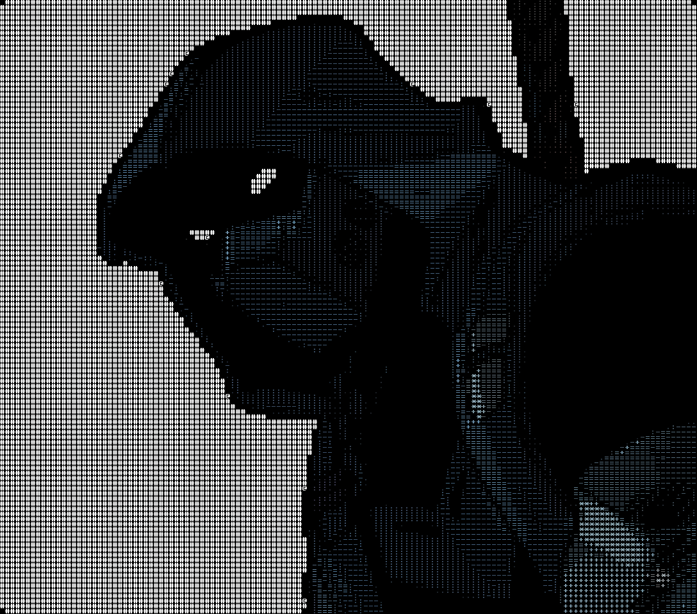

<table>
<tr>
<td width="40%" valign="top">
  
</td>
<td width="60%" valign="top">

### Hi, I'm an ML Engineer with a Masters in AI from Scotland

**Currently learning:**
- **Recommendation Systems**: Neural collaborative filtering, two-tower architectures, and LLM-augmented recommendations
- **Modern Transformer Architectures**: RoPE, Multi-Query Attention (MQA), Mixture of Experts (MoE), and efficient inference with vLLM

---

**Tools & Technologies**

  

  
  
  
  
  

</td>
</tr>
</table>
